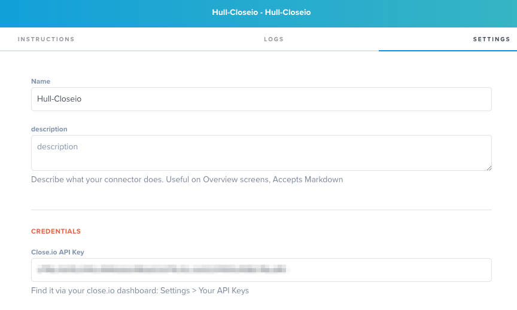
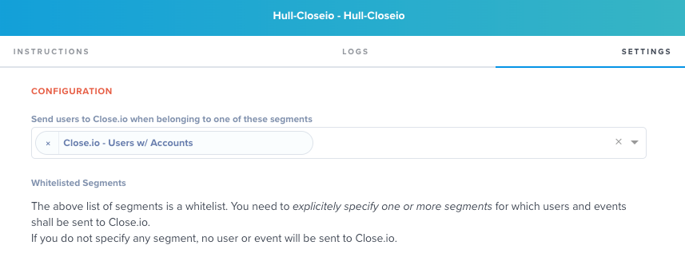
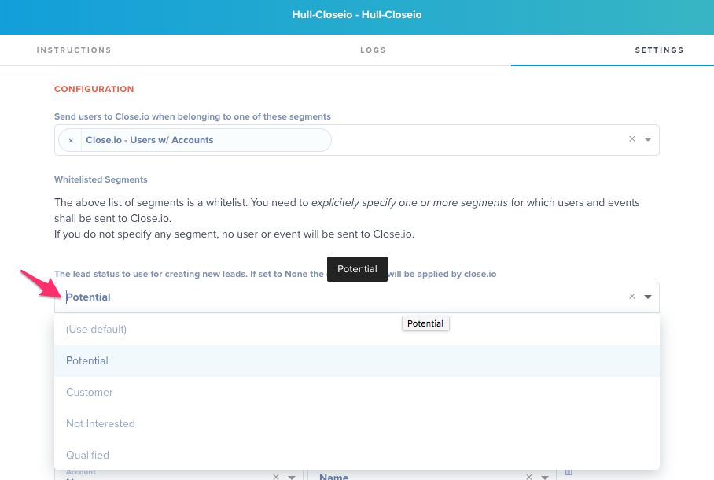
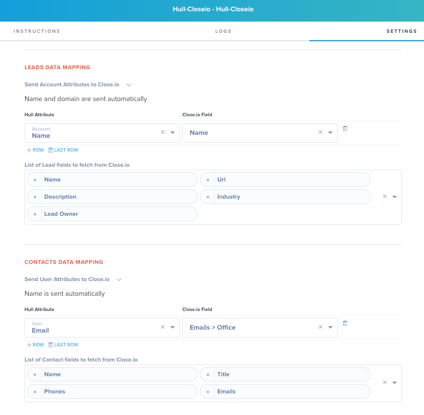
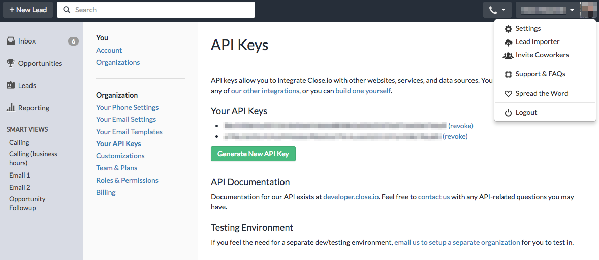

# Hull Close.io Connector

 The Close.io Connector enables your team to synchronize accounts and users from Hull to leads and contacts in your close.io system.

## Getting Started

 Go to the Connectors page of your Hull organization, click the button “Add Connector” and click “Install” on the Close.io card. After installation, go to the Settings tab and enter your API Key:
 

 Press the Save button to securely store your key and refresh the page to allow the Connector to fetch all information from close.io.

## Specify the Accounts and Users to synchronize

The Close.io Connector fetches updates for all leads and contacts from Close.io automatically.
By default no accounts and users are sent from Hull to Close.io, you need to customize this behavior first and explicitly define the segments. Go to the “Settings” tab of the connector and locate the section “Configuration”. Specify the segments in the following field:

## Specify the lead status for new leads

You can determine the lead status explicitely that Hull uses when creating new leads in close.io.
If you don't define a status, close.io will apply its default logic to determine the status.
You can modify the lead status in the "Settings" tab of the connector in the section "Configuration" by selecting
the desired status from the dropdown:

## Determine the Attributes to synchronize

You can customize the attributes which are getting synchronized with Close.io in the sections "Leads Data Mapping" and "Contacts Data Mapping" of the "Settings" tab:

The Connector automatically synchronizes the name and domain from Hull accounts to close.io leads. For users only the name is automatically synchronized with close.io contacts.

Phones, emails and urls are lists in close.io, Hull will synchronize these lists and flatten them by type.
If you have a contact with two emails, one of type `office` and another one with type `home`, the user in Hull will get
two attributes `email_office` and `email_home`.

**Unsupported fields:** Close.io leads have opportunities associated with them, however this field is not supported when synchronizing data with Hull.

## Find your API key

In your close.io application click on your name in the top right corner, select `Settings` and choose `Your API Keys`.
On the API Keys page you can either copy+paste an existing key or generate a new one:
